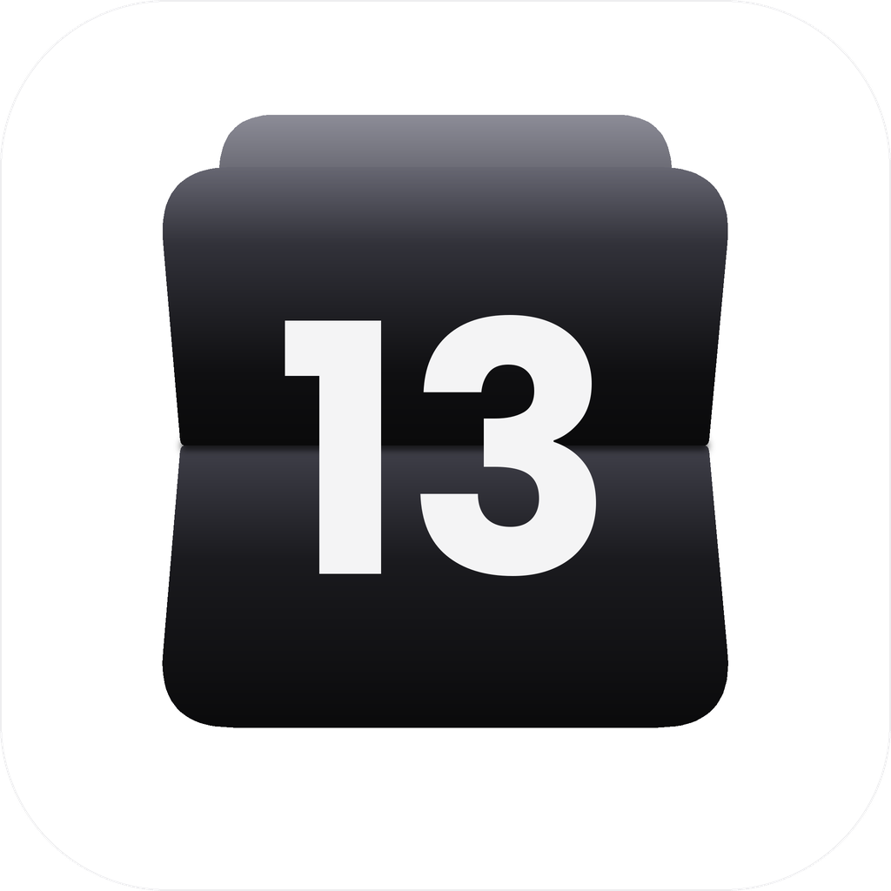

  
  <h1>Calendario Web App</h1>

Una aplicación web personal y minimalista diseñada para visualizar la semana actual unificando los eventos de Google Calendar y las tareas de Google Tasks.

## Características Principales

- **Landing Page Pública:** Interfaz inicial con capturas y explicaciones del funcionamiento de la app (no requiere registro para ver de qué trata).
- **Autenticación:** Login seguro e integrado exclusivamente con Google (OAuth).
- **Vista de Calendario Semanal:** Panel privado que sincroniza y muestra en un solo lugar los datos de Google Calendar y Google Tasks.
- **Panel de Ajustes:**
  - Modo de color (claro / oscuro / automático).
  - Ocultar las tareas en la vista semanal.
  - Eliminar todos los datos del usuario de la aplicación.

## Stack Tecnológico y Herramientas

- **Frontend:** HTML, CSS, JavaScript (Vanilla).
- **Backend:** PHP.
- **Base de Datos:** MySQL.
- **Integraciones / APIs:**
  - [Google Calendar API](https://developers.google.com/calendar) - Sincronización de eventos.
  - [Google Tasks API](https://developers.google.com/tasks) - Sincronización de tareas.
- **Entornos:**
  - **Local:** MAMP (Apache, MySQL, PHP).
  - **Producción:** InfinityFree.

## Configuración y Despliegue Local (MAMP)

1. **Clonar el repositorio:**
   Ubica el proyecto dentro de la carpeta `htdocs` de tu instalación de MAMP.
2. **Base de Datos:**
   Importa el esquema de la base de datos (si aplica) desde phpMyAdmin en `http://localhost/phpMyAdmin`.
3. **Variables de Entorno (Credenciales):**
   Crea el archivo de configuración correspondiente (ej. `.env` o `config.php` excluido en `.gitignore`) y añade tus credenciales:
   - Client ID y Secret de Google Cloud Console.
4. **Ejecución:**
   Inicia los servidores de Apache y MySQL en MAMP y accede a `http://localhost/tu-carpeta-del-proyecto`.

## Seguridad y Privacidad

- **No** se suben claves API ni credenciales al repositorio.